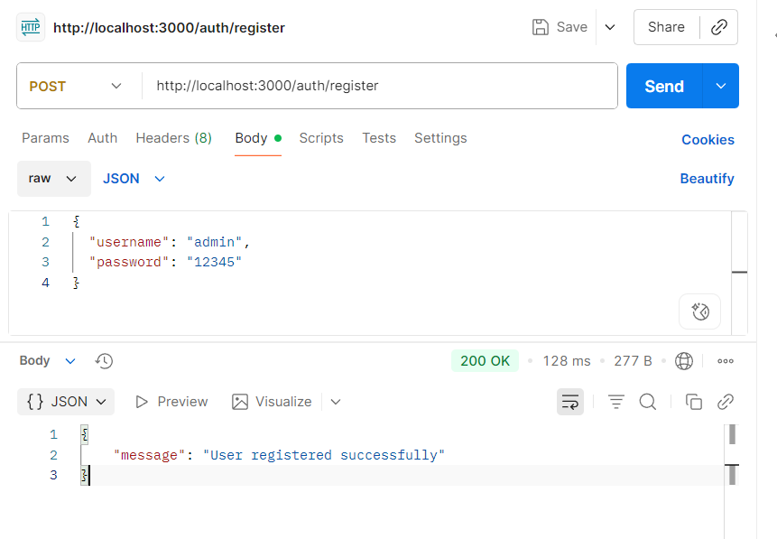
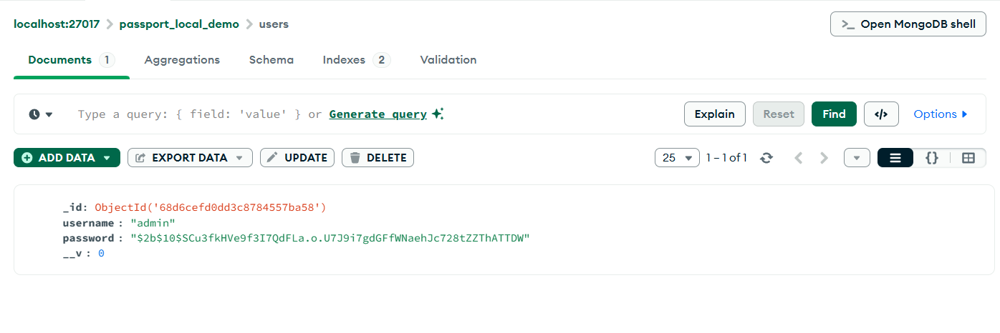
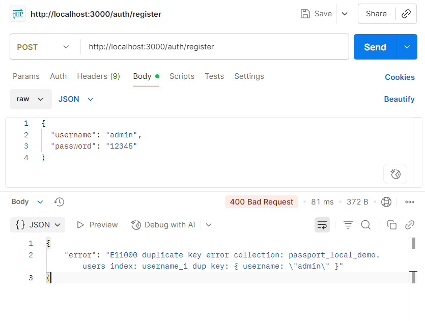
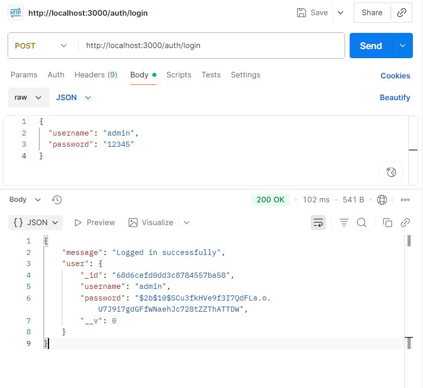
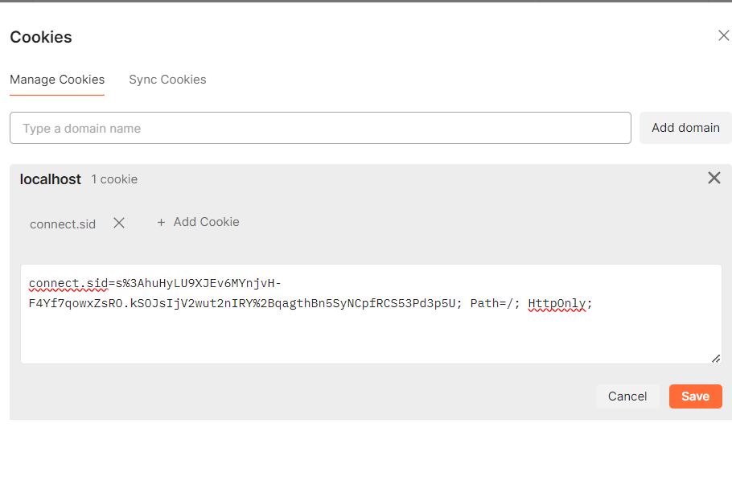
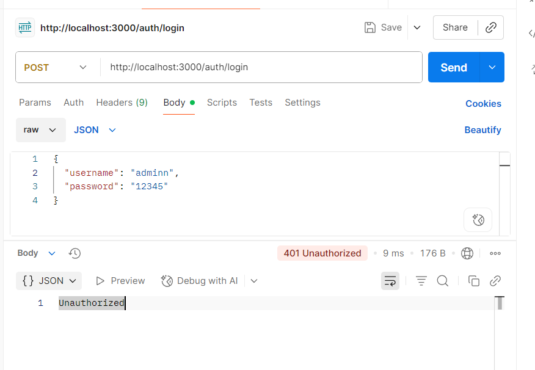
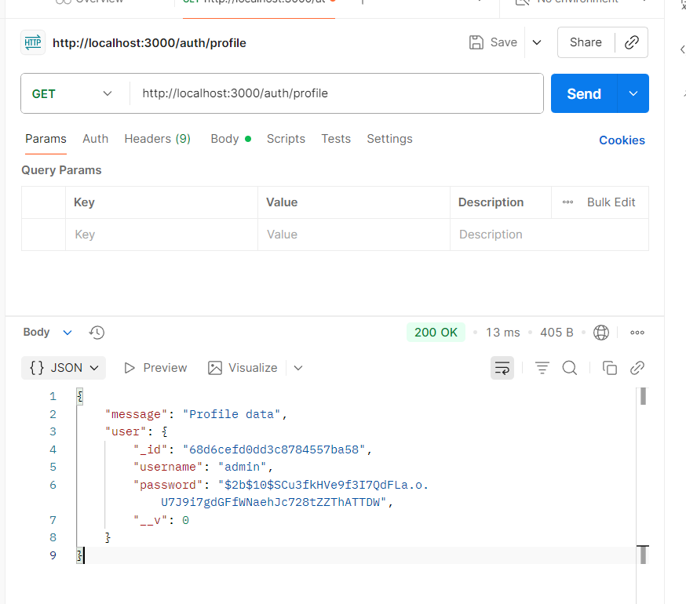
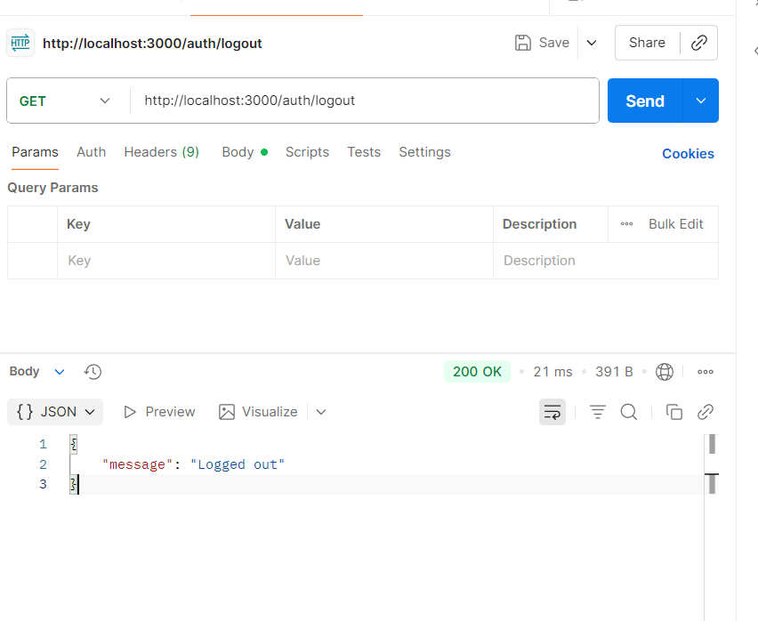
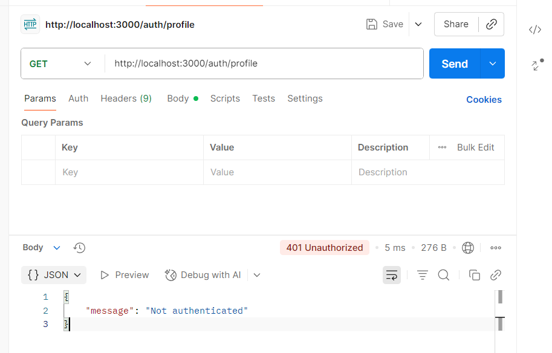

"# local_passport_auth_service" 
npm install

-Khởi chạy server App : node app.js

ĐĂNG KÝ THÀNH CÔNG
Method: POST
URL: http://localhost:3000/auth/register
Body (raw JSON):
{
  "username": "admin",
  "password": "12345"
}
Kết quả: "message": "User registered successfully"

Check in database

==============================================
ĐĂNG KÝ KHÔNG THÀNH CÔNG
Method: POST
URL: http://localhost:3000/auth/register
Body (raw JSON):
{
  "username": "admin",
  "password": "12345"
}
Kết quả: 
{
    "error": "E11000 duplicate key error collection: passport_local_demo.users index: username_1 dup key: { username: \"admin\" }"
}

==============================================
ĐĂNG NHẬP THÀNH CÔNG
Method: POST
URL: http://localhost:3000/auth/login
Body (raw JSON):
{
  "username": "admin",
  "password": "12345"
}
Kết quả: 
{
    "message": "Logged in successfully",
    "user": {
        "_id": "68d6cefd0dd3c8784557ba58",
        "username": "admin",
        "password": "$2b$10$SCu3fkHVe9f3I7QdFLa.o.U7J9i7gdGFfWNaehJc728tZZThATTDW",
        "__v": 0
    }
}

==============================================
ĐĂNG NHẬP KHÔNG THÀNH CÔNG
Method: POST
URL: http://localhost:3000/auth/login
Body (raw JSON):
{
  "username": "adminn",
  "password": "12345"
}
Kết quả: Unauthorized

==============================================TRUY CẬP ROUTE BẢO VỆ
Method: GET
URL: http://localhost:3000/auth/profile
Kết quả: 
{
    "message": "Profile data",
    "user": {
        "_id": "68d6cefd0dd3c8784557ba58",
        "username": "admin",
        "password": "$2b$10$SCu3fkHVe9f3I7QdFLa.o.U7J9i7gdGFfWNaehJc728tZZThATTDW",
        "__v": 0
    }
}

==============================================
ĐĂNG XUẤT
Method: GET
URL: http://localhost:3000/auth/logout
Kết Quả: "message": "Logged out"

==============================================
TRUY CẬP ROUTE BẢO VỆ SAU KHI LOGOUT
Method: GET
URL: http://localhost:3000/auth/profile
Kết quả: "message": "Not authenticated"
